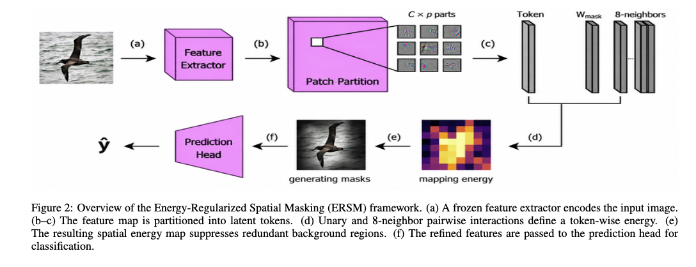
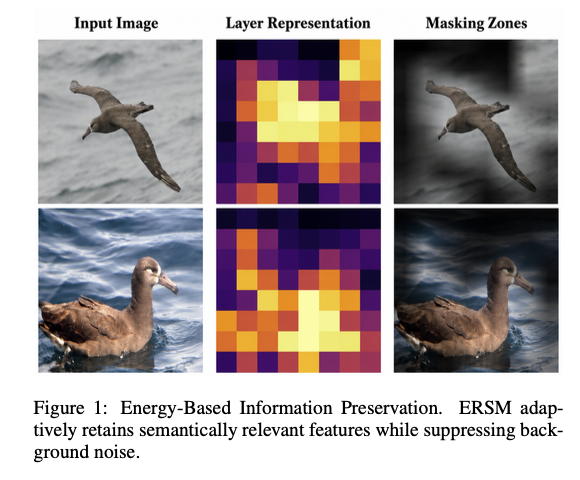

# Energy-Regularized Spatial Masking (ERSM)

> **Accepted at IJCAI 2026**
> Tom Devynck, Bilal Faye, Djamel Bouchaffra, Nadjib Lazaar, Hanane Azzag, Mustapha Lebbah

[[Paper]](https://arxiv.org/abs/2604.06893) · [[PDF]](https://arxiv.org/pdf/2604.06893)

---

## Overview

ERSM reformulates spatial feature selection in CNNs as a **differentiable energy minimization problem**. A lightweight Energy-Mask Layer is inserted between a frozen backbone and the classifier head, assigning each visual token a scalar energy composed of two competing forces:

- **Unary cost** — learned per-token importance score
- **Pairwise penalty** — spatial coherence over the 8-connected neighbourhood

Rather than enforcing rigid sparsity budgets or heuristic importance scores, ERSM lets the network autonomously discover an optimal information-density equilibrium for each input. The result is emergent sparsity, improved robustness to structured occlusion, and interpretable spatial masks — without any pixel-level supervision.

---

## Method

<p align="center">
  
</p>
<p align="center"><em>Pipeline de la méthode</em></p>

---

## Qualitative Results

<p align="center">
  
</p>
<p align="center"><em>ERSM adaptively retains semantically relevant features while suppressing background noise, without any spatial supervision signal.</em></p>

---

## Project Structure

```
ERSM/
├── main.py              # Entry point — runs the full experiment grid
├── config.py            # Hyperparameters and experiment grid definition
├── requirements.txt
├── assets/              # Figures used in the paper and this README
└── src/
    ├── __init__.py      # Public API re-exports
    ├── data.py          # Dataset loading (CUB-200, Oxford Pets, Food-101)
    ├── models.py        # EnergyMaskLayer, FrozenBackboneWrapper, build_backbone
    ├── training.py      # Training loop and accuracy evaluation
    ├── analysis.py      # Robustness curves, mask distribution, visual panels
    └── gradcam.py       # Grad-CAM, deletion AUC comparison, sparsity/entropy
```

---

## Installation

```bash
pip install -r requirements.txt
```

Requires Python 3.9+ and a CUDA-capable GPU (falls back to CPU automatically).

---

## Quick Start

```bash
python main.py
```

Results (JSON + PNG visualisations) are saved to `results/`.

---

## Configuration

Edit `config.py` to change:

| Parameter      | Description                                            | Default                         |
|----------------|--------------------------------------------------------|---------------------------------|
| `DATASET_NAME` | Dataset (`cub200`, `pets`, `food`)                     | `food`                          |
| `ARCHS`        | Backbone architectures to benchmark                    | ResNet-50, ConvNeXt-T, EfficientNetV2-S |
| `EPOCHS`       | Training epochs                                        | 20                              |
| `LAMBDA`       | Unary energy weight                                    | 1e-3                            |
| `GAMMA`        | Pairwise smoothness weight                             | 1e-3                            |
| `TEMP`         | Sigmoid temperature for keep-probability               | 1.0                             |

The experiment grid sweeps over `SIZES` (input resolutions) and `PATCHES` (patch sizes applied to feature maps).

---

## Supported Datasets

| Dataset | Classes | Notes |
|---------|---------|-------|
| CUB-200-2011 | 200 bird species | Auto-downloaded |
| Oxford-IIIT Pets | 37 breeds | Auto-downloaded |
| Food-101 | 101 food categories | Auto-downloaded |

---

## Supported Architectures

ResNet-18/50, ConvNeXt (Tiny/Small/Base/Large), EfficientNet-B0–B7, EfficientNetV2 (S/M/L).

---

## Citation

If you use this work, please cite:

```bibtex
@inproceedings{devynck2026ersm,
  title     = {Energy-Regularized Spatial Masking: A Novel Approach to Enhancing
               Robustness and Interpretability in Vision Models},
  author    = {Devynck, Tom and Faye, Bilal and Bouchaffra, Djamel and
               Lazaar, Nadjib and Azzag, Hanane and Lebbah, Mustapha},
  booktitle = {Proceedings of the Thirty-Fifth International Joint Conference
               on Artificial Intelligence (IJCAI)},
  year      = {2026},
  note      = {arXiv:2604.06893}
}
```
